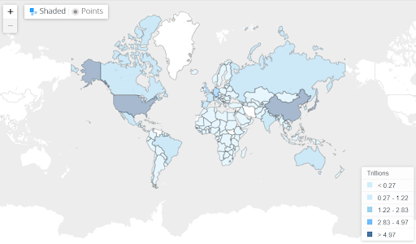
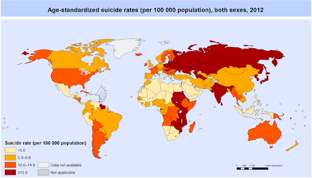

---
output:
  html_document: default
  pdf_document: default
---
# Countries, Generations and Mental Health  
### Project: Death of a Boomer
  
Harrison Liao  
&nbsp;&nbsp;&nbsp;&nbsp;&nbsp;&nbsp;hxliaoay@uw.edu  
Kaushal Bommena  
&nbsp;&nbsp;&nbsp;&nbsp;&nbsp;&nbsp; bommek@uw.edu  
Freezer Yang  
&nbsp;&nbsp;&nbsp;&nbsp;&nbsp;&nbsp; wfeng98@uw.edu

Info-201: Technical Foundations of Informatics:  
&nbsp;&nbsp;&nbsp;&nbsp;&nbsp;&nbsp;The Information School, University of Washington, Autumn 2019

### 1.0 Introduction  
#### 1.1 Problem Situation?  
&nbsp;&nbsp;&nbsp;&nbsp;&nbsp;&nbsp;Suicide has been an issue for mankind forever, and there has been causes of all sorts.  In this case, we decide to take it on a larger scale, taking countries as unit of analysis with the focus of financial issues as we hypothesize it as a major cause of suicide.  

&nbsp;&nbsp;&nbsp;&nbsp;&nbsp;&nbsp;The stakeholders would be the Government and mental health institutions, as well as people,  feel the need to suicide.  

&nbsp;&nbsp;&nbsp;&nbsp;&nbsp;&nbsp;Some value tensions to consider would be how each country would react differently to the necessity to understand the economic implications to suicide rates, given their varied cultural stances on the topic of mental health. 

#### 1.2 What is the problem?  
&nbsp;&nbsp;&nbsp;&nbsp;&nbsp;&nbsp; With mental health becoming an increasingly crucial matter in the present day, it is absolutely necessary to shed light on the factors affecting suicide rates, in this case, the economy (country’s GDP). 

#### 1.3 Why does it matter?  
&nbsp;&nbsp;&nbsp;&nbsp;&nbsp;&nbsp;In a simple matter, people around the world are dying, and if we know some of the causes of suicide we could prevent it, or at least some of the cases.  Here, if proven economical issues are related, reliefing two crisis at once would be more than ideal.  

#### 1.4 How will it be addressed?  
&nbsp;&nbsp;&nbsp;&nbsp;&nbsp;&nbsp;In this case, we’ll take into account the country itself, its GDP, and its suicide rates of generation and gender of the country.  We analyze it by generation instead of years is because we have considered that these blocks of generations are defined between historical events that more or less drastically changed the minds of the people, which could relate to suicide and the way people think of the economy.

### 2.0 Research Questions  
1. Does a country with a higher GDP have lower suicide rates?  
2. How suicide rates have been changed throughout each generation?

### 3.0 Possible Data Sets  
1. [Suicide Rates Overview 1985 to 2016](https://www.kaggle.com/russellyates88/suicide-rates-overview-1985-to-2016)
  - This is data set includes the suicide numbers and rates of countries by year, gender and age, which will be used as our reference to change in suicide rates.
2. [World Bank GDP data 1965 to 2018](https://data.worldbank.org/indicator/NY.GDP.MKTP.CD) 
  - This data sets includes the GDP of countries around the world, which will be matched with the previous said dataset.  Combining the two allows us to see how the economic factor influences the suicide rates.
  
### 4.0 Information Vizualisations  
  
- The image above is a screenshot of the interactive map from the website of the World Bank, which we retrieved the data from.  It shows the GDP of countries in 2018, sorted by the hue of the color.  

  
- The map above shows the age-standardized suicide rate(both sexes) in 2012. Image from the World Health Organization which is partially included in the kaggle data set.
  

### 5.0 Team Coordination
- weekly times: 1-2 times a week,  after quiz section + sometime Friday night
- individual goals:
  - Harrison: minor requirements + r skills for sociology major  
  - Freezer: Able to present data in a visual way + Pass the class  
  - Kaushal: Learning R and understanding the importance of data analytics in current affairs while getting exposure to hands-on experience in data science.  
- how to communicate:  
  - Check text msgs at times, Microsoft teams
- how to give feedback:  
  - Comments on code, discussion in Microsoft teams and text group chat
  
### 6.0 References  
- Rusty. “Suicide Rates Overview 1985 to 2016.” Kaggle, 1 Dec. 2018, https://www.kaggle.com/russellyates88/suicide-rates-overview-1985-to-2016.   
- “GDP (Current US$).” Data, The World Bank, https://data.worldbank.org/indicator/NY.GDP.MKTP.CD.

